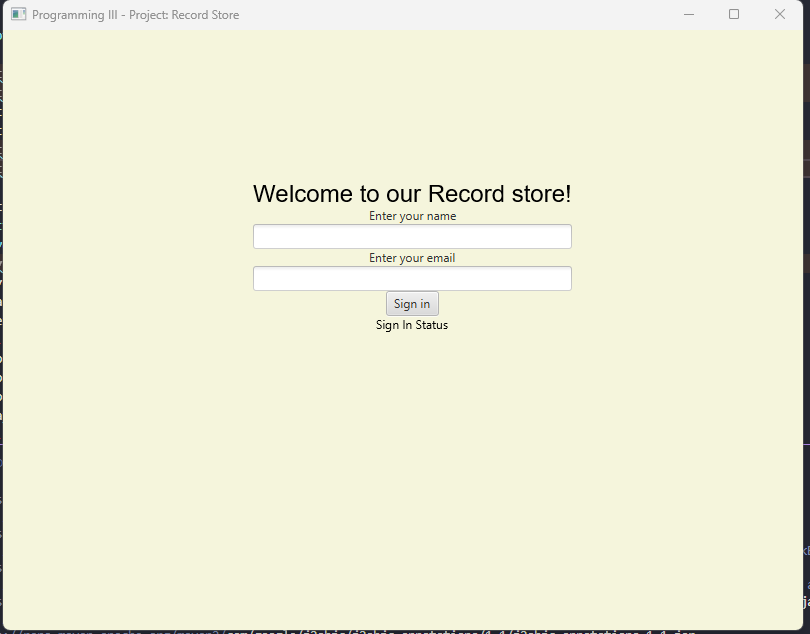

# Record Store Management System

**Fall 2022 Project**  
**Authors:** Luca Fratipietro, Melissa Bangloy

## Project Overview

A comprehensive Record Store Management System built in Java that simulates a music store selling albums in multiple formats (CD, Vinyl, and Digital). The system manages customer memberships with tiered benefits and implements a points-based reward system.

## Features

### Album Management
- **Multiple Format Support**: CD, Vinyl, and Digital formats
- **Complete Album Information**: Artist, title, label, genre, year of release, and track listing
- **Format-Specific Pricing**: Different prices for each format type
- **Points System**: Earn points based on purchase and membership level

### Customer Management
- **Tiered Membership System**: Bronze, Silver, and Gold membership levels
- **Customer Profiles**: Name, email, phone, address, and membership level
- **Points Accumulation**: Different point earning rates based on membership tier
- **Member Benefits**: Tier-specific rewards and benefits

## System Architecture

### Core Classes

#### Album System
- **`Album.java`** (Interface) - Base album type
  - **`CD.java`** - CD format implementation
  - **`Vinyl.java`** - Vinyl format implementation
  - **`Digital.java`** - Digital format implementation

#### Customer System
- **`MemberRegistrationForm.java`** (Abstract Class) - Base registration form
  - **`Client.java`** - Extends MemberRegistrationForm, represents store customers
- **`MembershipLevel.java`** (Interface) - Defines membership behavior
  - **`Bronze.java`** - Bronze tier implementation
  - **`Silver.java`** - Silver tier implementation  
  - **`Gold.java`** - Gold tier implementation

## Technical Implementation

### Object-Oriented Design Principles
- **Inheritance**: Client extends MemberRegistrationForm
- **Polymorphism**: Different album formats and membership levels
- **Interfaces**: Album and MembershipLevel interfaces for consistent behavior
- **Abstract Classes**: MemberRegistrationForm for common registration functionality

### Key Methods
- **`calculateGainedPoints()`** - Implemented by each membership tier
- **Customer registration and profile management**
- **Album inventory management**
- **Purchase processing with points calculation**

## Data Management

### Initial Data Set
- **12 hardcoded records** for testing and development
- **6 sample members** across different membership tiers
- **Expandable database** with scripts for adding more records and members

### Data Structure
- Record listings with complete metadata
- Artist information and cataloging
- Member profiles with accumulated points
- Purchase history and transaction records

## Repository Information

> **Note:** This repository has been migrated from GitLab to GitHub for better portfolio visibility and collaboration.
> 
> **Original Repository:** [https://gitlab.com/melissa_louise/fall2022_project](https://gitlab.com/melissa_louise/fall2022_project)  
> **Current Repository:** Now hosted on GitHub under melissa0987

## Getting Started

### Prerequisites
- Java Development Kit (JDK) 8 or higher
- IDE (Eclipse, IntelliJ IDEA, or similar)
- Git for version control

### Installation
1. Clone the repository:
   ```bash
    git clone https://github.com/melissa0987/RecordStoreManagementSystem.git
    cd RecordStoreManagementSystem/project
   ```
2. Run the application:
   ```bash
    mvn clean javafx:run
   ```

---
## HOW TO USE THE PROGRAM

### 1. Login

When prompted, enter the following user credentials:


- **Name:** `James`  
- **Email:** `emailTest`

> These are the default credentials for simulating a client login.
 

### 2. View Profile

After logging in, choose **View Profile** from the menu to display the client’s current information:

- Name  
- Email  
- Membership Level  
- Purchase History (if applicable)
 

### 3. Edit Profile

Choose **Edit Profile** to:

- Update your **name** or **email**
- **Upgrade** your membership level (e.g., from Basic to Premium)

> Changes are saved immediately.
 

### 4. Show Sorted/Filtered List

Use this option to view the available products with the ability to:

- **Sort** by title, artist, genre, or price  
- **Filter** based on category, availability, or membership benefits

> 🛒 Use this to browse before making a purchase.

---

## Testing

### Unit Testing Strategy
- **Standalone class testing** for core business logic
- **Membership tier calculation testing**
- **Album format pricing verification**
- **Customer registration validation**

### Testing Considerations
- Database-dependent classes require mock data for testing
- File I/O operations need separate test environments
- Member and Album classes integration testing

## Development Team

### Work Distribution
- **Luca Fratipietro**: Album type UML design and implementation
- **Melissa Bangloy**: Client and Membership type UML design and implementation

### Development Practices
- **Version Control**: Git with feature branches
- **Code Reviews**: Weekly team meetings for code review
- **Documentation**: Comprehensive commenting and documentation
- **Collaboration**: Regular sync meetings and pair programming sessions

## Learning Objectives

This project demonstrates mastery of:
- **Class Design**: Proper use of abstract classes and interfaces
- **Inheritance and Polymorphism**: Multiple inheritance hierarchies
- **File I/O**: Reading and writing customer and inventory data
- **Testing**: Unit test development and debugging
- **Teamwork**: Collaborative development using Git
- **Code Quality**: Readable, maintainable code structure


## Project Structure

```
RecordStoreManagementSystem
│   .gitignore 
│   README.md
│
└───project
    │   clientlist.txt
    │   couponFile.txt
    │   pom.xml
    │   RecordStore.txt
    │
    ├───.vscode
    │       launch.json
    │       settings.json
    │
    ├───loadCSVtest
    │       recordTest1.txt
    │
    └───src
        ├───main
        │   └───java
        │       └───com
        │           └───example
        │               │   App.java
        │               │   ClientControl.java
        │               │   OrderItemController.java
        │               │   RecordGUI.java
        │               │   Shop.java
        │               │   SignInAttempt.java
        │               │   SignInPage.java
        │               │   StorePage.java
        │               │
        │               └───back
        │                       App.java
        │                       Cart.java
        │                       CD.java
        │                       Client.java
        │                       ClientList.java
        │                       Coupon.java
        │                       CouponList.java
        │                       DigitalRecord.java
        │                       DollarCoupon.java
        │                       LoadCSV.java
        │                       LoadProducts.java
        │                       LoadSQL.java
        │                       MembershipLevel.java
        │                       OrderItem.java
        │                       PercentageCoupon.java
        │                       Record.java
        │                       RecordStore.java
        │                       Vinyl.java
        │
        ├───sql
        │       clientDB.sql
        │       couponDatabase..sql
        │       productsDb.sql
        │
        └───test
            └───java
                └───com
                    └───example
                        └───back
                                CartTest.java
                                CDTest.java
                                ClientListTest.java
                                ClientTest.java
                                CouponListTest.java
                                DigitalRecordTest.java
                                DollarCouponTest.java
                                LoadCSVTest.java
                                MembershipLevelTest.java
                                OrderItemTest.java
                                PercentageCouponTest.java
                                RecordStoreTest.java
                                VinylTest.java
```

## License

This project is part of an academic assignment for Fall 2022 coursework.

---

**Course Project** | **Object-Oriented Programming** | **Fall 2022** 

